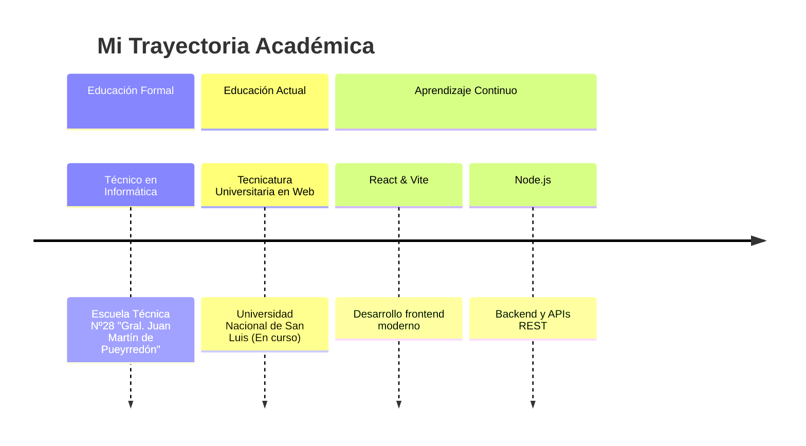

<div align="center">

# 🚀 ¡Hola! Soy Rothezee 


<p align="center">
  
  
</p>

### 🌟 Desarrollador Fullstack & Especialista en Sistemas Embebidos
### 📍 Argentina | 💡 1 año 4 meses de experiencia profesional

---

</div>

## 🎯 Sobre Mí

```typescript
const rothezee = {
    role: "Fullstack Developer & Embedded Systems Specialist",
    location: "Argentina 🇦🇷",
    experience: "1 año 4 meses",
    passion: ["Tecnología", "Aprendizaje continuo", "Resolver problemas reales"],
    currentFocus: "Sistemas embebidos como único desarrollador en mi empresa",
    philosophy: "Desde la idea hasta la producción ✨"
};
```

<div align="center">

## 🛠️ Stack Tecnológico

### 🎨 Frontend
<p>
  
</p>

### ⚙️ Backend  
<p>
  
</p>

### 🗄️ Bases de Datos
<p>
  
</p>

### 🔧 Sistemas Embebidos
<p>
  
  
  
</p>

### 🛠️ Herramientas
<p>
  
</p>

</div>

---

## 📊 Estadísticas GitHub

<div align="center">
  
  
</div>

<div align="center">
  
</div>

---

## 🏆 Proyectos Destacados

<table>
<tr>
<td width="50%">

### 🌐 [Dweb-ProyectoFinal](https://github.com/Rothezee/Dweb-ProyectoFinal)
**Web del complejo de cabañas con recorrido virtual**
- `HTML` `CSS` `JavaScript`
- Experiencia inmersiva para usuarios
- Interfaz moderna y responsiva

</td>
<td width="50%">

### 🕹️ [Sistema-de-reportes-web](https://github.com/Rothezee/Sistema-de-reportes-web)
**Backoffice para máquinas arcade**
- `PHP` `MySQL` `JavaScript`
- Panel de control administrativo
- Gestión de datos en tiempo real

</td>
</tr>
<tr>
<td width="50%">

### 💰 [EXPENDEDORA-MINI-PC](https://github.com/Rothezee/EXPENDEDORA-MINI-PC)
**App de escritorio Python para control de fichas**
- `Python` `GUI`
- Automatización de procesos
- Interfaz intuitiva

</td>
<td width="50%">

### 📊 [esp32_project](https://github.com/Rothezee/esp32_project)
**Panel web para monitoreo de máquina electromecánica**
- `ESP32` `PHP` `IoT`
- Monitoreo en tiempo real
- Integración hardware-software

</td>
</tr>
</table>

<div align="center">

### 🎮 [Ahorcado](https://github.com/Rothezee/Ahorcado)
**Juego clásico implementado en C**
- Proyecto personal de práctica
- Lógica de programación pura
- `C Programming`

</div>

---

## 🎓 Formación & Aprendizaje

<div align="center">



</div>

---

## 🌍 Idiomas

<div align="center">

| Idioma | Nivel |
|--------|-------|
| 🇪🇸 **Español** | Nativo |
| 🇺🇸 **Inglés** | Técnico Intermedio |

</div>

---

## 🎮 Cuando no estoy programando...

<div align="center">

<table>
<tr>
<td align="center">

### ⛹️ Deportes
Manteniéndome activo y saludable

</td>
<td align="center">

### 🎮 Videojuegos
Relajación y estrategia

</td>
<td align="center">

### 🎵 Música
Inspiración y creatividad

</td>
<td align="center">

### 📚 Aprendiendo
Siempre algo nuevo por descubrir

</td>
</tr>
</table>

</div>

---

## 🤝 ¡Conectemos!

<div align="center">

[](mailto:rothalan83@gmail.com)
[](https://linkedin.com/in/tuprofile)
[](https://github.com/rothezee)

### 💡 ¿Tienes un proyecto interesante? ¡Hablemos!

</div>

---

<div align="center">

### 🚀 Siempre abierto a nuevos desafíos y colaboraciones


</div>
